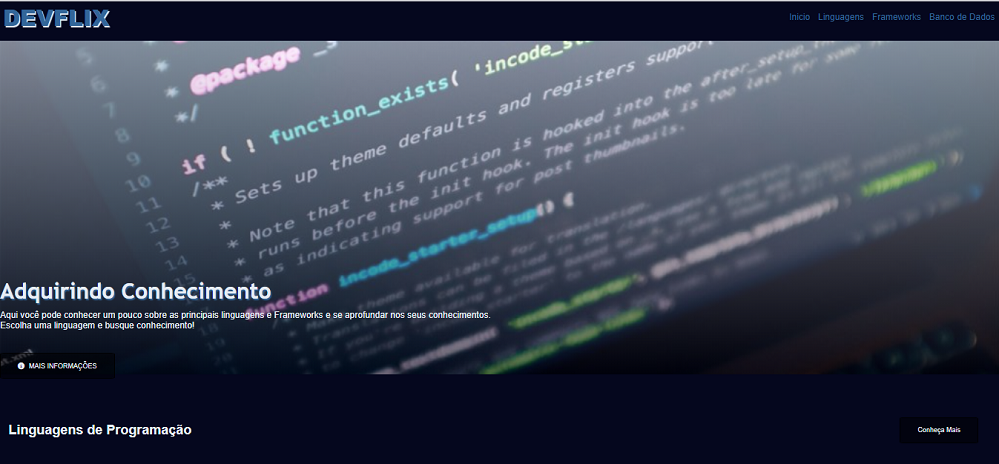

# DIO Desafio GitHub

### Bootcamp Carrefour Web Developer

## 🏁 Tópicos
 
  * 👉 [Banner](#banner)
  * 👉 [Título](#título)
  * 👉 [Descrição](#✒️-descrição)
  * 👉 [Status](#⏱️-status)
  * 👉 [Funcionalidades](#🔨-funcionalidades-🛠️)
  * 👉 [Demonstração](#🚀-demonstração)
  * 👉 [Pré-requisitos](#📋-pré-requisitos)
  * 👉 [Tecnologias utilizadas](#⚙️-tecnologias-utilizadas)
  * 👉 [Acesso ao Projeto](#📁-acesso-ao-projeto)
  * 👉 [Pessoas Contribuidoras](#🖇️-pessoas-contribuidoras-🤝)
  * 👉 [Autor](#🏆-autor)
  * 👉 [Licença](#🙏-licença-🔖) 
  * 👉 [Conclusão](#📚-conclusão)
 
______________________________________________________________

##  Banner
  

    
  

______________________________________________________________

## 📌 Título

#### Recriando a interface do Netflix

______________________________________________________________
## ✒️ Descrição

#### Recriei a interface porém transformei numa plataforma para obter mais conhecimento das linguagens de Programação, framewors e banco de dados.

______________________________________________________________
## ⏱️ Status 

>  🚀 Projeto Concluído com Sucesso!!! 👌 🚧

______________________________________________________________
## 🔨 Funcionalidades 🛠️

- `1 ` Conhecer as principais linguagens de programação ✔️
- `2 ` Conhecer os principais frameworks ✔️
- `3 ` Conhecer os banco de dados mais conhecidos ✔️

______________________________________________________________
## 🚀 Demonstração 

> 🚧 Em construção 🚧
______________________________________________________________
## 📋 Pré-requisitos 
 ✔️ nenhum
__________________________________________________
## ⚙️ Tecnologias utilizadas

- 
- 
- 

## 📁 Acesso ao Projeto 

### Link: [Projeto](https://alinealmeida85.github.io/dio-desafio-github/)

______________________________________________________________
## 🖇️ Pessoas Contribuidoras 🤝

  [ Aline Melissa Andrade de Almeida ](https://github.com/AlineAlmeida85) 

______________________________________________________________
## 🏆 Autor 

  [ Aline Almeida 💝](https://github.com/AlineAlmeida85) 

______________________________________________________________
## 🙏 Licença 🔖

#### Não Possui ✔️
______________________________________________________________
## 📚 Conclusão 

Aprendi a manipular elementos, estilização dos mesmos e componetização.
______________________________________________________________

⌨️ com ❤️ por [Aline Almeida](https://github.com/AlineAlmeida85) 😊

Espero que te agrade! 

